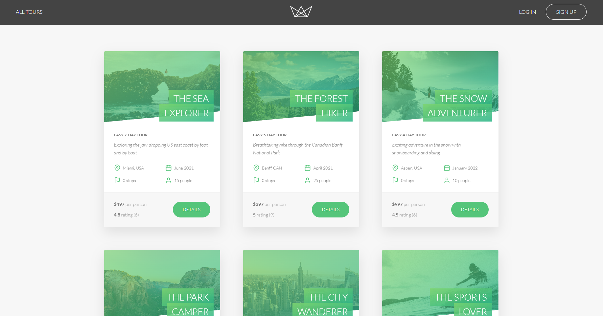
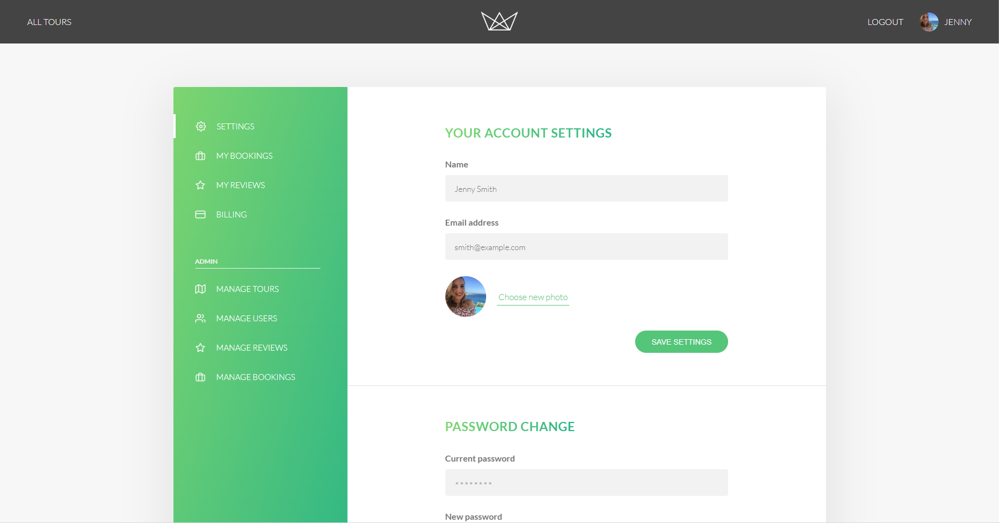

# na-tours





## Tech Stack

1. **JavaScript**: For functionality and interactivity.
2. **Pug (formerly Jade)**: For clean and structured templating.
3. **HTML5**: For content structure and semantic markup.
4. **CSS3**: For styling, including animations and transitions.

## Usage

Clone it :

```
$ git clone https://github.com/Dibyaranjan450/na-tours.git
```

Visit the page at :

```
https://na-tours-dibya-nayaks-projects.vercel.app/
```

## Contributor

- Creator of na-tours [@Dibyaranjan450](https://github.com/Dibyaranjan450)
